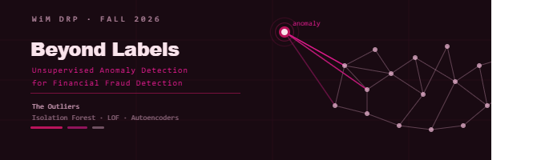

# Beyond Labels: Unsupervised Anomaly Detection for Financial Fraud Detection



<sub>[View the animated banner directly](assets/fraud_detection_banner.svg)</sub>

<sub>[Open the canvas animation recording source](assets/fraud_detection_banner_gif.html)</sub>

[](https://www.python.org/)
[](https://scikit-learn.org/)
[](https://pytorch.org/)
[](https://www.kaggle.com/)

This repository contains the research code and materials for the [Women in Mathematics Directed Reading Program (WiM DRP)](https://uwaterloo.ca/women-in-mathematics/directed-reading-research-programs-drp) at the University of Waterloo, Fall 2026. The project team is **The Outliers**.

## Project Overview

Financial fraud is difficult to identify because fraudulent transactions are rare, evolving, and often poorly represented by reliable labels. This project investigates whether unsupervised anomaly detection can identify potentially fraudulent transactions without using fraud labels during model training.

We compare two primary methods, Isolation Forest and Local Outlier Factor (LOF), across three financial transaction datasets. Autoencoders are included as a stretch goal. Labels are withheld during training and are used only after scoring for evaluation and analysis.

## Learn More

[](https://www.youtube.com/results?search_query=fraud+detection+machine+learning+isolation+forest+autoencoder)

Explore video explainers covering fraud detection, anomaly detection, Isolation Forest, and autoencoders.

## Research Question

How effectively can unsupervised anomaly detection methods identify financial fraud across datasets with different transaction structures, class imbalance, and feature distributions?

The comparison will consider detection quality, computational cost, sensitivity to preprocessing and contamination assumptions, and how consistently each method transfers across datasets.

## Methods

### Isolation Forest

Isolation Forest isolates observations by randomly partitioning the feature space. Rare and unusual observations tend to be isolated in fewer splits, producing higher anomaly scores.

### Local Outlier Factor

LOF compares the local density around an observation with the density around its neighbors. An observation in a substantially less-dense region than its neighbors is treated as a local outlier.

### Autoencoders (stretch goal)

An autoencoder is a neural network trained to reconstruct predominantly normal transaction data. A large reconstruction error can indicate an anomalous transaction. This method will be implemented if time and compute resources permit.

## Potential Datasets

The project may use the following Kaggle datasets:

1. **ULB Credit Card Fraud Detection**: anonymized European card transactions with a highly imbalanced fraud label.
2. **IEEE-CIS Fraud Detection**: identity and transaction features from an e-commerce fraud detection competition.
3. **PaySim**: synthetic mobile money transactions with transaction-type, account-balance, and fraud fields.

Download instructions, expected Kaggle identifiers, and data-handling notes are in [data/README.md](data/README.md). Raw data is not committed to this repository. During training, remove or withhold the target label and any direct leakage features; restore the labels only for post-hoc evaluation.

## Repository Structure

```text
.
├── README.md
├── requirements.txt
├── .gitignore
├── data/
│   └── README.md
├── notebooks/
│   ├── isolation_forest/
│   ├── lof/
│   └── autoencoders/
├── results/
│   ├── isolation_forest/
│   ├── lof/
│   └── autoencoders/
└── paper/
```

Notebook directories contain exploratory analysis and experiments for each method. Results directories contain generated figures, metrics, and tables. The paper directory contains drafts, references, and final research materials.

## Setup

Python 3.10 or newer is recommended.

```bash
git clone https://github.com/Nafisatibrahim/unsupervised-fraud-detection-the-outliers
cd unsupervised-fraud-detection-the-outliers
python -m venv .venv
```

Activate the environment:

```bash
# macOS/Linux
source .venv/bin/activate

# Windows PowerShell
.venv\Scripts\Activate.ps1
```

Install the dependencies:

```bash
python -m pip install --upgrade pip
pip install -r requirements.txt
```

Configure Kaggle credentials according to the Kaggle documentation before downloading data. Then follow [data/README.md](data/README.md). Kaggle credentials must never be committed.

## Running the Code

Start Jupyter from the repository root:

```bash
jupyter lab
```

Run notebooks in this order for each method:

1. Load and inspect the selected dataset.
2. Separate labels and exclude leakage-prone columns.
3. Fit preprocessing transformations on the training features only.
4. Train the anomaly detector without labels.
5. Save scores and predictions under the matching `results/` directory.
6. Evaluate against the withheld labels using metrics such as precision-recall AUC, ROC AUC, precision at a fixed review budget, recall, and the confusion matrix.

Keep dataset-specific experiments and outputs clearly named. Because the datasets differ in scale and feature availability, compare methods both within each dataset and across appropriate normalized summaries.

## Reproducibility Notes

- Record random seeds, feature-selection decisions, preprocessing steps, model parameters, and contamination or threshold choices.
- Do not tune models against labels during the unsupervised training phase.
- Treat labels as an evaluation artifact and document every post-hoc thresholding rule.
- Save environment and experiment details with result files where practical.

## Team

**The Outliers** is the mentee team for the [Women in Mathematics Directed Reading Program](https://uwaterloo.ca/women-in-mathematics/directed-reading-research-programs-drp) at the University of Waterloo, Fall 2026.

Project focus: unsupervised learning, anomaly detection, and responsible evaluation for financial fraud detection.

## License

See [LICENSE](LICENSE) for the repository license. Dataset licenses and terms are determined by the respective Kaggle dataset owners and must be reviewed before redistribution.
